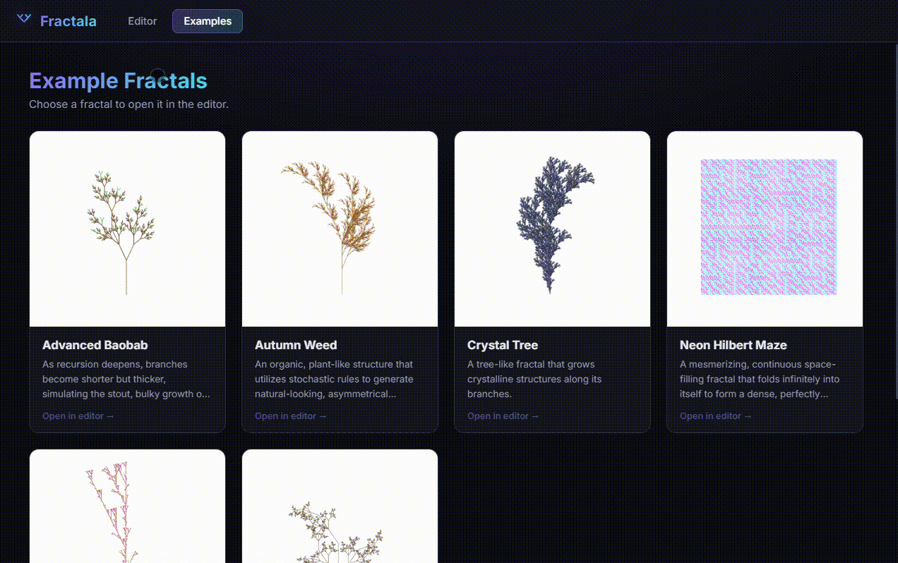
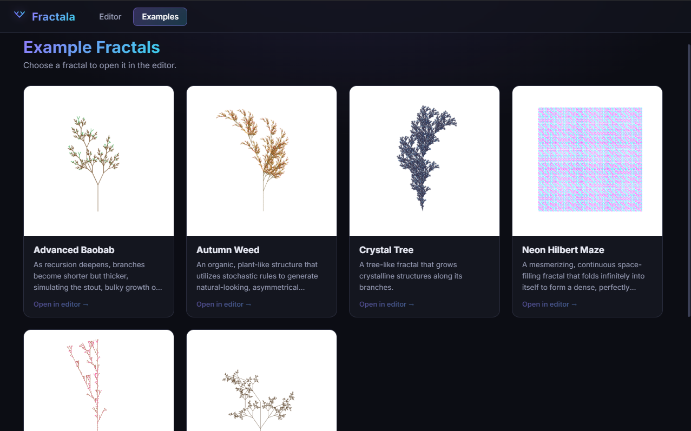
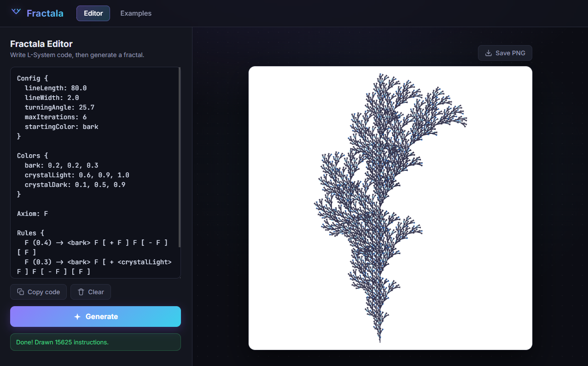
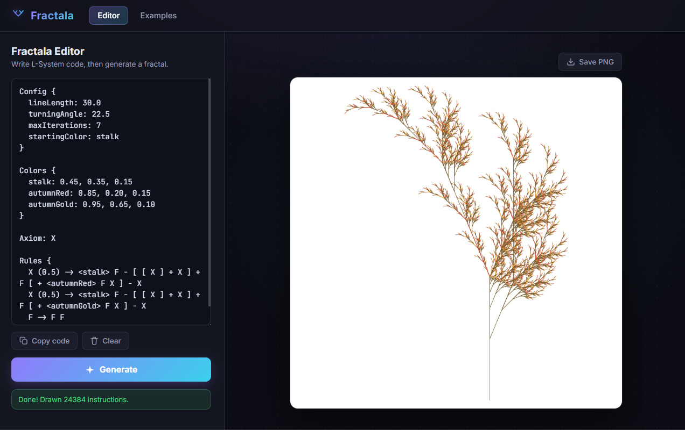
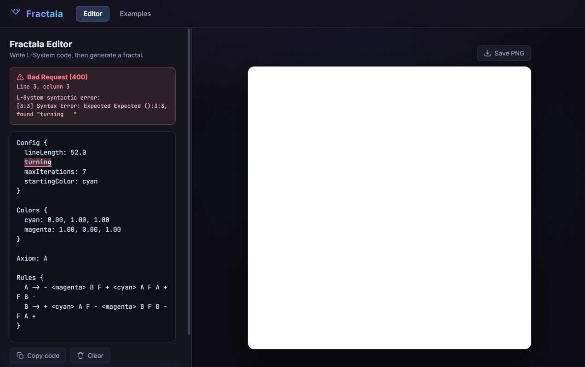

# Fractala


Fractala is a powerful, web-based fractal generator powered by **L-Systems**. It features a custom, human-readable DSL for defining fractal structures, supports stochastic (probabilistic) growth for organic patterns, and provides a real-time interactive editor.

## Preview



## Showcase

### Catalog of Examples



### Real-time Editor
The interactive environment where you can write DSL code and see instant results.




### Error Reporting
Clear and concise feedback for DSL syntax and logical errors.


## Features

- **Custom DSL**: A simple, type-safe language to define fractals.
- **Stochastic Rules**: Add randomness to your fractals for more organic, "real-world" looks.
- **Real-time Feedback**: See your changes immediately as you type.
- **Robust Error Handling**: Clear feedback when your DSL code has syntax or logical errors.

## Tech Stack

Fractala is built with a modern functional stack leveraging the power of Scala across the entire system.

### Core & Backend

| Category | Technology |
| :--- | :--- |
| **Language** | [Scala 3](https://www.scala-lang.org/) |
| **Effect System** | [Cats Effect 3](https://typelevel.org/cats-effect/) |
| **Web Server** | [Http4s](https://http4s.org/) (Ember) |
| **API Documentation** | [Tapir](https://tapir.softwaremill.com/) (with Swagger UI) |
| **JSON Library** | [Circe](https://circe.github.io/circe/) |
| **Parser** | [Fastparse](https://com-lihaoyi.github.io/fastparse/) (for the DSL) |
| **Linear Algebra** | [Breeze](https://github.com/scalanlp/breeze) |
| **Configuration** | [PureConfig](https://pureconfig.github.io/pureconfig/) |

### Frontend

| Category | Technology |
| :--- | :--- |
| **Language** | [Scala.js](https://www.scala-js.org/) (Scala 3) |
| **Bundler** | [Vite](https://vitejs.dev/) |
| **DOM Manipulation** | [Scala.js DOM](https://scala-js.github.io/scala-js-dom/) & [Scalatags](https://github.com/lihaoyi/scalatags) |
| **Styling** | Vanilla CSS |

## Writing Fractals (The DSL Syntax)

Fractala uses a custom, human-readable Domain Specific Language (DSL) to define L-Systems. The language is **case-insensitive** for keywords and **order-independent**, allowing you to structure your fractal definitions freely.

### The Four Main Blocks

| Block | Purpose | Required |
| :--- | :--- | :---: |
| `Config` | Defines rendering parameters like line length, angle, and iterations. | No |
| `Colors` | Maps descriptive names to RGB values (0.0 - 1.0). | No |
| `Axiom` | The starting string (state) of the L-System. | **Yes** |
| `Rules` | Defines how each symbol evolves into a new sequence. | **Yes** |

---

### Command Reference

The following symbols control the "turtle" as it draws the fractal:

| Symbol | Action |
| :---: | :--- |
| `F` | **Draw Forward**: Moves the turtle and draws a line. |
| `f` | **Move Forward**: Moves the turtle without drawing a line. |
| `+` | **Turn Left**: Rotates the turtle by the `turningAngle`. |
| `-` | **Turn Right**: Rotates the turtle by the `turningAngle`. |
| `[` | **Push State**: Saves the current position and angle on the stack (starts a branch). |
| `]` | **Pop State**: Restores the last saved position and angle (ends a branch). |
| `\|` | **Reverse**: Turns the turtle 180 degrees. |
| `<color>` | **Change Color**: Switches the drawing color to one defined in the `Colors` block. |
| `#` / `!` | **Width +/-**: Increments or decrements the line width. |
| `>` / `<` | **Scale +/-**: Multiplies or divides the current line length. |
| `(` / `)` | **Angle +/-**: Increments or decrements the turning angle. |
| `@` | **Dot**: Draws a dot at the current position. |
| `A-Z`, `0-9` | **Variable**: Structural placeholders used in rules (non-drawing). |

---

### Advanced Features

#### 1. Stochastic Rules (Randomness)
To create organic-looking fractals, you can assign weights to rules. When a symbol has multiple rules, the generator picks one based on its probability.

```plaintext
Rules {
  F (0.4) -> F [ + F ] F
  F (0.6) -> F [ - F ] F
}
```

#### 2. Configuration Options
The `Config` block supports the following fields (all optional):

| Field | Description | Default |
| :--- | :--- | :---: |
| `lineLength` | The base length of each segment. | 10.0 |
| `lineWidth` | The initial thickness of lines. | 1.0 |
| `turningAngle` | The angle (in degrees) for `+` and `-` operations. | 45.0 |
| `maxIterations` | How many times to apply the rules. | 4 |
| `startingColor` | The name of the initial color from the `Colors` block. | white |
| `lineLengthMultiplier`| Factor for `>` and `<` operations. | 2.0 |
| `lineWidthIncrement` | Amount to change width for `#` and `!`. | 1.0 |
| `turningAngleIncrement` | Amount to change angle for `(` and `)`. | 15.0 |

---

### Example: The Advanced Baobab

This example showcases stochastic rules, branching, and dynamic color changes to create a realistic tree structure.

```plaintext
Config {
  lineLength: 40.0
  lineWidth: 2.0
  turningAngle: 25.0
  lineLengthMultiplier: 0.75
  lineWidthIncrement: 1.2
  maxIterations: 6
  startingColor: bark
}

Colors {
  bark: 0.45, 0.30, 0.15
  leaves: 0.25, 0.65, 0.30
}

Axiom: X

Rules {
  // Main growth rule with branching
  X -> <bark> F [ + X ] [ - X ] + F [ - X ]
  
  // Exponential trunk growth
  F -> F F
  
  // 15% chance to sprout leaves instead of bark
  X (0.15) -> <leaves> F [ + F ] [ - F ]
}
```

## Getting Started

Follow these steps to get Fractala up and running on your local machine.

### Prerequisites

Before you begin, ensure you have the following installed:
- **JDK 17 or newer** (e.g., [Temurin](https://adoptium.net/)).
- **sbt 1.x** (see `project/build.properties` for the pinned version).
- **Node.js 18 or newer** (required for the frontend).

---

### Step 1: Start the API Server

The backend provides the fractal generation engine and catalog service. It runs on `http://localhost:9000` by default.

#### Recommended: Standalone Launcher
On Windows, two `sbt` processes cannot run in the same project simultaneously due to file locks. Since the frontend also uses `sbt`, we recommend running the API as a standalone process:

1. Build the launcher:
   ```powershell
   sbt "project api" stage
   ```
2. Run the generated script:
   ```powershell
   .\api\target\universal\stage\bin\fractala-api.bat
   ```

#### Alternative: Quick Start (API only)
If you are only working on the backend, you can run it directly via sbt:
```powershell
sbt "project api" run
```

---

### Step 2: Start the Frontend

The frontend is a Scala.js application that communicates with the API.

1. Navigate to the frontend directory:
   ```powershell
   cd frontend
   ```
2. Install dependencies (first time only):
   ```powershell
   npm install
   ```
3. Start the development server:
   ```powershell
   npm run dev
   ```

Once started, Vite will provide a local URL (typically `http://localhost:5173`). Open it in your browser to start creating fractals!

---

### Advanced Configuration

#### Customizing the API
The backend uses **PureConfig**. Default settings are in `api/src/main/resources/application.conf`. You can override them using environment variables:
```powershell
$env:SERVER_PORT="9000"; sbt "project api" run
```

#### Configuring the Frontend API URL
By default, the frontend looks for the API at `http://localhost:9000`. To change this, create a `frontend/.env` file:
```env
VITE_API_BASE_URL=https://your-api.example.com
```

#### Production Build
To create a production-ready bundle of the frontend:
```powershell
cd frontend
npm run build
npm run preview
```

## Contributors

- [Adam Gracikowski](https://github.com/adamgracikowski)
- [Marcin Falkowski](https://github.com/xxmarcin007)
- [Mikołaj Karbowski](https://github.com/mikolajkarbowski)
- [Dominik Zieliński](https://github.com/xxxDKGxxx)
